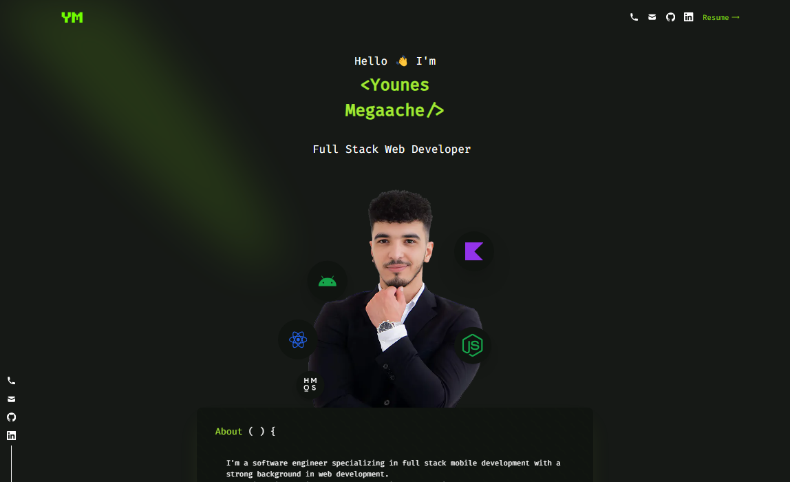

# Younes Megaache's personal website

<p align="center">

</p>

My personal website , designed loosely in Figma and coded in VS Code, built using Next.js and TailwindCSS, deployed to Vercel.
Text is in the FiraCode typeface

👉 https://younes-megaache.com/

# Table of content

- [Get started](#get-started)
  - [Analytics (Optional)](#analytics-optional)
- [deploy to vercel](#deploy-to-vercel)
- [General deployment steps](#general-deployment-steps)
- [Tech Stack](#tech-stack)
- [Todo](#todo)
- [License](#license)

## Get started

1. clone this repo: `git clone https://github.com/megaacheyounes/portfolio-tailwind`
1. install node packages: `yarn` or `npm i`
1. add your information, under folder `src/data` update all files with your data (e.g. personal information, projects, experiences..)
1. replace resume (CV) in the folder `public`, must be PDF with name `resume.pdf` (if file extension or name is different, then update `RESUME_PATH` in `utils/env.ts`)
1. run and test your portfolio: `yarn dev` or `npm run dev`
1. make a build (to make sure there will be no compilation errors when you deploy): `yarn build` or `npm run build`

##### Analytics (Optional)

If you wish to add analytics, but do not want extensions or browsers to block it, then you can use [Ackee](https://github.com/electerious/Ackee) self hosted Analytics, its a free and open source Analytics tool that you can deploy easily and for free to [vercel](https://vercel.com/) or other Node.js hosting providers.

1. follow Ackee instructions to deploy your analytics platform, for deploying to Vercel see: [Ackee with vercel](https://github.com/electerious/Ackee/blob/master/docs/Get%20started.md#with-vercel)
1. create a domain in your Ackee tool
1. update `src/utils/env.ts` with your Ackee analytics base URL, Ackee script URL and domain ID

**If you do <ins>NOT</ins> which to add Analytics, then set the flag `ENABLE_ANALYTICS` to false, in `src/tools/env.ts`**

## deploy to vercel

Vercel is a free and very convenient platform to publish Next.js projects (Next.js is developed by vercel)

1. create a repo using your github account [github.com/new](https://github.com/new), then add repo link: `git remote add origin <your repo link>`
1. publish the project to your repo: `git push origin master`
1. import your repo in Vercel: [vercel.com/new](https://vercel.com/new)

Vercel will automatically run the build script every time you merge into master branch, as well as generating previews when you push to dev branch

## General deployment steps

this project is static, therefor you can deploy it to any web hosting (e.g. Firebase hosting)

1. update next.config.js: set value `output` to `export` (learn more: [vercel docs](https://nextjs.org/docs/pages/building-your-application/deploying/static-exports))
1. make a build: `yarn build`
1. upload the static files under `/out` (e.i. html, css and js) to your web hosting provider (e.g. Firebase hosting)

## Tech Stack

- ⚡️ Next.js 13 with App Router
- ⚛️ React 18
- ✨ TypeScript
- 💨 Tailwind CSS 3 — Configured with CSS Variables to extend the primary colors
- 📈 Absolute Import and Path Alias — components imported using `@/` prefix
- 📏 ESLint — to find and fix problems, also auto sort imports
- 💖 Prettier — code formatting and consistency
- 📈 Analytics - supports Ackee self hosted Analytics https://github.com/electerious/Ackee

## Todo

- [ ] update all npm packages
- [ ] add documentation
- [ ] add E2E tests
- [ ] add contact form
- [ ] improve animations

## License

```license
               DO WHAT YOU WANT TO PUBLIC LICENSE

 Copyright (C) 2024 Younes Megaache

 Everyone is permitted to copy and distribute verbatim or modified
 copies of this license document, and changing it is allowed as long
 as the name is changed.

                DO WHAT YOU WANT TO PUBLIC LICENSE
   TERMS AND CONDITIONS FOR COPYING, DISTRIBUTION AND MODIFICATION

  0. You just DO WHAT YOU WANT TO.
```
